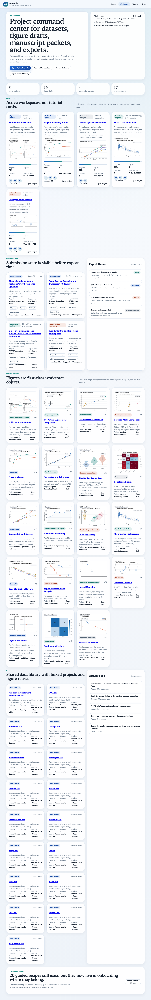

# AssayAtlas

[](https://github.com/felizvida/assayatlas/releases)
[](https://github.com/felizvida/assayatlas/blob/main/LICENSE)

AssayAtlas is a production-oriented SaaS-style GraphPad Prism alternative built around one promise: publication-grade figures should be the default output, not the last mile.

This repository ships a runnable product shell with:

- a true SaaS-style workspace for projects, figures, datasets, manuscripts, and exports,
- 20 guided, real-data tutorial use cases kept separate from the workspace,
- a persisted SQLite workspace runtime seeded from the generated manifest on first boot,
- generated analysis artifacts and polished chart assets,
- a hand-held training tutorial with step-by-step instructions,
- and a Flask web app with a landing page, workspace, docs center, tutorial, and manuscript export flow.

## What is in the product shell

- Workspace entities: active projects, figure drafts, manuscript packets, dataset library pages, export queue, and activity feed.
- Guided analyses: t tests, ANOVA, paired studies, regression, nonlinear fitting, survival, Cox modeling, logistic regression, contingency analysis, PCA, and QC review.
- Figure-first workflows: raw-point plots, violin plots, Kaplan-Meier curves, kinetic fits, PK profiles, correlation heatmaps, and a four-panel publication board.
- Training assets: a real-data tutorial and a use-case catalog generated from the same manifest that drives the app.

## Quick start

```bash
python3 -m venv .venv
./.venv/bin/pip install -r requirements.txt
./.venv/bin/python scripts/build_examples.py
./.venv/bin/python run.py
```

Open [http://127.0.0.1:5000](http://127.0.0.1:5000).

Primary routes:

- `/` landing page
- `/workspace` project command center
- `/projects/<slug>` project workspaces
- `/figures/<slug>` figure draft pages
- `/datasets/<slug>` dataset detail pages
- `/manuscripts/<slug>` manuscript packet pages
- `/tutorial` step-by-step training view
- `/docs` rendered documentation center

Runtime API routes:

- `GET /api/workspace`
- `GET|PATCH /api/projects/<slug>`
- `GET|POST /api/export-jobs`
- `PATCH /api/export-jobs/<job_key>`
- `GET /api/workspace-events`



## Documentation

- Training tutorial: `docs/tutorial/REAL_DATA_TRAINING_TUTORIAL.md`
- Use-case catalog: `docs/tutorial/USE_CASE_CATALOG.md`
- Publication workflow: `docs/PUBLICATION_WORKFLOW.md`
- Architecture: `docs/ARCHITECTURE.md`
- Deployment: `docs/DEPLOYMENT.md`
- Modernization plan: `docs/MODERNIZATION_PLAN.md`
- Contributing: `CONTRIBUTING.md`
- Security policy: `SECURITY.md`

## Validate locally

```bash
./.venv/bin/python scripts/build_examples.py
./.venv/bin/python -m unittest discover -s tests -v
```

## Container run

```bash
docker build -t assayatlas .
docker run --rm -p 5000:5000 assayatlas
```

## Why this shape

GraphPad Prism users love polished figures, approachable analysis flows, and quick movement from input table to submission-ready panel. This product shell focuses on those strengths first, but now separates onboarding recipes from the real workspace so projects, figure drafts, datasets, and manuscript packets feel like first-class SaaS objects.

## Notes

- All tutorial outputs are generated from real public datasets or open example datasets shipped with Python packages.
- The web app reads a generated manifest from `data/generated/use_cases.json`; rebuild it whenever you change the use-case generator.
- The workspace runtime persists to `data/assayatlas.db` and seeds from the generated manifest the first time it needs workspace records.
- The persisted runtime now exposes a small JSON API for workspace reads, project updates, export jobs, and workspace event history.
- The README screenshot is produced after the app is running and the tutorial pages are captured locally.
